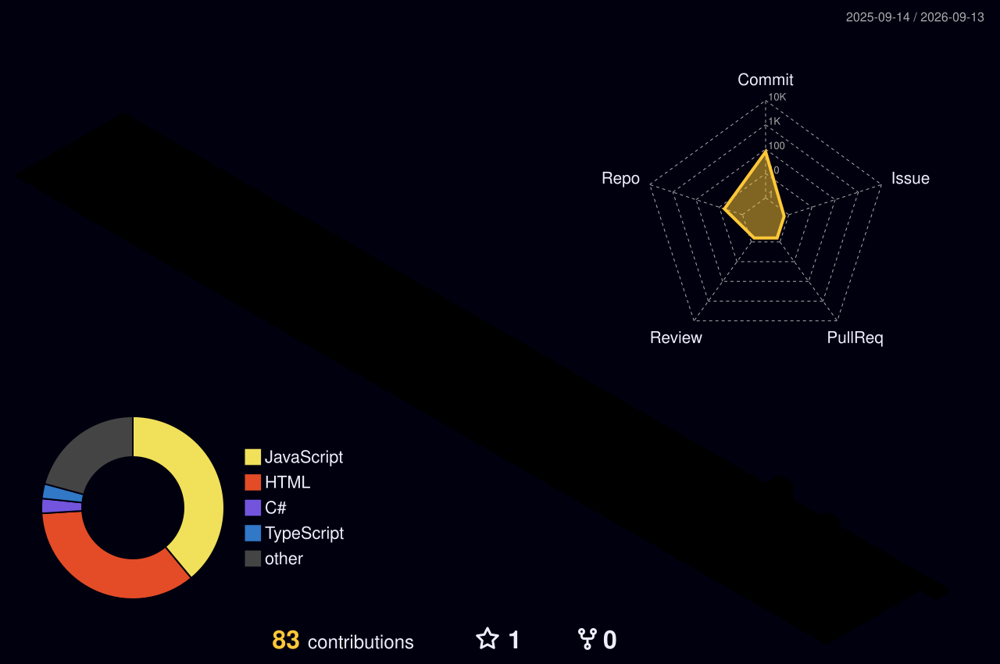

# Adinan da Rocha Lima

LegalTech · Web · Automação · IA aplicada

Python · Node.js · PyQt6 · SQL · LLMs · RAG

📍 Sorocaba/SP · [LinkedIn](https://www.linkedin.com/in/adinan-lima-7a17402b9) · adinansp@gmail.com

---

### 🎓 Formação Acadêmica

* **Bacharelado em Engenharia de Computação** — UNIVESP *(2025 – 2029 | Em andamento)*
* **Pós-graduação em Direito Civil** — Universidade Cruzeiro do Sul *(2022)*
* **Bacharelado em Direito** — Universidade Cruzeiro do Sul *(2021)*
* **Bacharelado em Ciências Policiais de Segurança e Ordem Pública** — Academia de Polícia Militar do Barro Branco *(2017)*

---

<!-- Gerado pela GitHub Action github-profile-3d-contrib -->

---

### 📬 Vamos nos conectar?

- **LinkedIn:** [linkedin.com/in/adinan-lima-7a17402b9](https://www.linkedin.com/in/adinan-lima-7a17402b9)
- **E-mail:** adinansp@gmail.com
- **Telefone:** (15) 98152-9175
